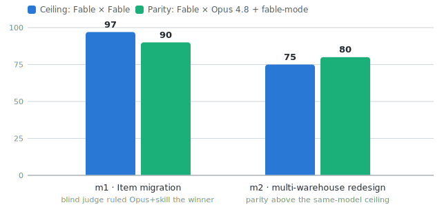

# fable-mode ⚔️

**Make Opus 4.8 (or any non-Fable model) process code like Claude Fable 5 — and prove it with a blind duel.**

Fable 5's practical edge in coding is not only raw capability: a large part is *process discipline* — how it orients before acting, verifies before claiming, names its judgment calls, and finishes migrations all the way to the last public seam. Capability is not promptable. Process is. This repo distills that process into an [Agent Skill](https://agentskills.io), then proves the distillation works the fun way: **we made them fight.**

## The duel

Same task, byte-identical copies of the same project, planted traps (false leads, hidden callers, tests contradicting the spec, authority pressure), and a blind judge who inspects the diffs and runs the tests without knowing which agent is which model. Then the honest twist: in round 3, **Fable also dueled itself**, so we could measure the real similarity ceiling — because two independent runs of the *same* model also disagree on design choices.

<picture>
  <source media="(prefers-color-scheme: dark)" srcset="docs/ceiling-dark.svg">
  
</picture>

On the harder task, **Opus + fable-mode ended up more similar to Fable than Fable is to itself** (parity 80 vs ceiling 75). And in the m1 duel the blind judge handed the win to *Opus over live Fable* — precisely on a rule this skill added (naming judgment calls where the spec is silent), plus a self-correction the judge singled out: it caught and strengthened its own weakened assertion instead of shipping it. The student out-applied the textbook.

### Scoreboard (9 blind duels, 4 iterations of the skill)

| Round | Scenarios | Similarity | Verdicts |
|---|---|---|---|
| 1 — short traps | s1–s5 | 88–99 (byte-identical diffs on s1–s3) | 4 ties, 1 marginal Fable win |
| 2 — long-horizon, tier 9–10 | l1–l2 | 88 / 88 | 2 marginal Fable wins |
| 3 — with skill v3 + same-model control | m1–m2 | parity 90 / 80 vs **ceiling 97 / 75** | 1 Opus win, 1 Fable win |

Mean parity **85** vs mean same-model ceiling **86**. Every win, in both directions, was by a marginal call — never a gross failure. All 7 round-1/2 scenarios passed a double adversarial audit (Sonnet auditors, then Fable 5 auditors instructed to refute everything): traps valid and identical in both copies, all verdicts standing; 11 minor nits (including one small overstatement in a Fable report and one discarded harness-artifact run), 0 conclusion-changing findings.

Honest scope: these are our internal evaluations on a single Ruby fixture — a reproducible method, not a third-party benchmark; the duel artifacts (fixture, scenario bank, diffs, judge verdicts) are not yet published. The m2 ceiling reading is a single control pairing (n=1) — a variance signal, not a precise ceiling. The operating loop is language-agnostic, but the taste catalog and all measured evidence are Ruby-only so far; taste files for other languages are welcome contributions.

## What's inside

| Path | What it is |
|---|---|
| `skills/fable-mode/SKILL.md` | The skill: Fable 5's operating loop — ORIENT → PLAN → ACT → VERIFY → REPORT — as an executable contract, with long-horizon protocol, red flags and common mistakes |
| `skills/fable-mode/fable-operating-logic.md` | The detailed map: every rule explained, plus the empirical evidence (all four benchmark rounds) behind each one |
| `skills/fable-mode/fable-taste-ruby.md` | Fable's Ruby design defaults, extracted by behavioral probing (24 forced-choice probes, 3 Fable samples vs 2 Opus) — only the 4 measured divergences need rules |
| `skills/fable-mode/fable-exemplars.md` | Few-shot cookbook: 6 canonical moves as verbatim diffs and report lines from Fable's duel sides — rules say *what*, exemplars show *the form* |
| `workflows/fable-heavy.js` | Claude Code Workflow for big tasks: scout → best-of-3 designs → judge panel → synthesized plan → disciplined executor → adversarial reviewers with fix loop |
| `docs/` | Benchmark charts used above |

## Install

### As a Claude Code plugin (recommended)

```
/plugin marketplace add renancarvalhoo/fable-mode
/plugin install fable-mode@fable-mode
```

The skill then shows up namespaced as `fable-mode:fable-mode` and updates with the repo.

### Manual

```sh
git clone https://github.com/renancarvalhoo/fable-mode.git
cd fable-mode
./install.sh
```

Or copy `skills/fable-mode/` into `~/.claude/skills/` yourself (installs as plain `fable-mode`).

Then wire it in your `~/.claude/CLAUDE.md` so it activates automatically:

```markdown
## Model Parity
- When running on any model other than Fable (Opus, Sonnet, Haiku), invoke the `fable-mode` skill at the start of any coding task and follow its loop
```

For the heavy pipeline, copy `workflows/fable-heavy.js` into your project's `.claude/workflows/` — this currently requires cloning the repo even if you installed the skill as a plugin. Its executor and fixer agents activate the fable-mode skill by name (either install works). Prerequisite: a Claude Code version with the Workflows feature (script orchestration — check that `/workflows` exists in your CLI).

## Usage

- **Skill**: invoke `/fable-mode` at the start of a coding task, or let the CLAUDE.md wiring trigger it.
- **Workflow**: ask Claude Code to `run the fable-heavy workflow for <your task>`. Cost: ~13 agents on a clean pass, 18–23 when review-fix rounds fire (3–5× the tokens of a plain run) — use it for large, ambiguous, or multi-file tasks only. For critical tasks, ask for it `with bestOf: 2`: two executors implement independently in isolated worktrees and a selector picks the winner by running distinguishing tests (~1.8× extra).

### Verify it's working

After installing, check the skill is listed (`/plugin` for plugin installs, or ask "what skills are available?" — look for `fable-mode` or `fable-mode:fable-mode`). An active session is observable: the agent opens a task by stating in one sentence what it is about to do, reproduces failures before editing, and its final reports lead with the outcome plus what was verified (commands and results). The CLAUDE.md snippet above matches both install names.

## How the gap actually closes

Every gap a blind judge found became a rule in the skill's core loop — duel → judged gap → rule → re-duel:

- **v2** — first-hand validation against live Fable 5's contract: mid-task narration, outward-facing actions require confirmation, turn-ending persistence, verified success stated without hedging. Plus round 1's finding: a fix that moves a threshold gets permanent boundary-pinning tests.
- **v3** — round 2's findings: a convention migration ends only when the old convention is gone from *every public seam* (grep the remnants); reports name every judgment call made where the spec was silent (a blanket "nothing left open" is overclaiming); a test superseded by a new requirement is updated *with the supersession named*, never silently.
- **v3.1** — round 3's last real gap: a compatibility claim ("X must keep working") is proven by exercising X through the *new* behavior — old tests staying green only proves the old path.

What doesn't close: the intrinsic quality of a single reasoning step. That's what `fable-heavy` is for — on big tasks, no critical decision ever depends on one reasoning step (3 independent designs, judge panel, adversarial reviewers).

## References

- **Methodology**: byte-identical project copies under git; planted traps verified in the baseline commit; blind judges (never told which agent is which model) with A/B positions alternated per scenario; judges inspect `git diff` and run the suite themselves; round 3 adds a same-model control duel (Fable × Fable) so parity is measured against the real ceiling, not against 100.
- **Scenario bank**: 9 scenarios over a Ruby fixture ("MiniStore", 16-test green suite) — false-lead debugging under time pressure, hidden-caller rename, authority pressure to edit a correct test, spec/test conflict, multi-file feature, whole-codebase Money migration, lifecycle redesign with an embedded superseded test, Item value-object migration, multi-warehouse atomic reservations.
- **Judging rubric**: six process dimensions (root cause, verification, honesty, completeness, trap resistance, report format, 0–5 each) + a 0–100 similarity index + verdict.
- **Audit**: every scenario and every final report double-audited adversarially (Sonnet pass, then Fable 5 pass instructed to *refute*) — scenario validity, report-vs-reality accuracy, judge defensibility.
- **Scale**: 51 subagents, ~1.74M tokens across the four executions (rounds 1–3 + the Fable audit pass).
- **Baseline honesty**: on short well-scoped tasks, Opus 4.8 + the Claude Code harness already behaves Fable-like even without the skill (it passed all the pre-skill pressure tests); with the skill, the round-1 duels produced byte-identical diffs on s1–s3. The skill's value is consistency insurance on long, ambiguous, context-degraded work — which is exactly where the judged gaps appeared, and where the rules closed them.

## License

MIT
